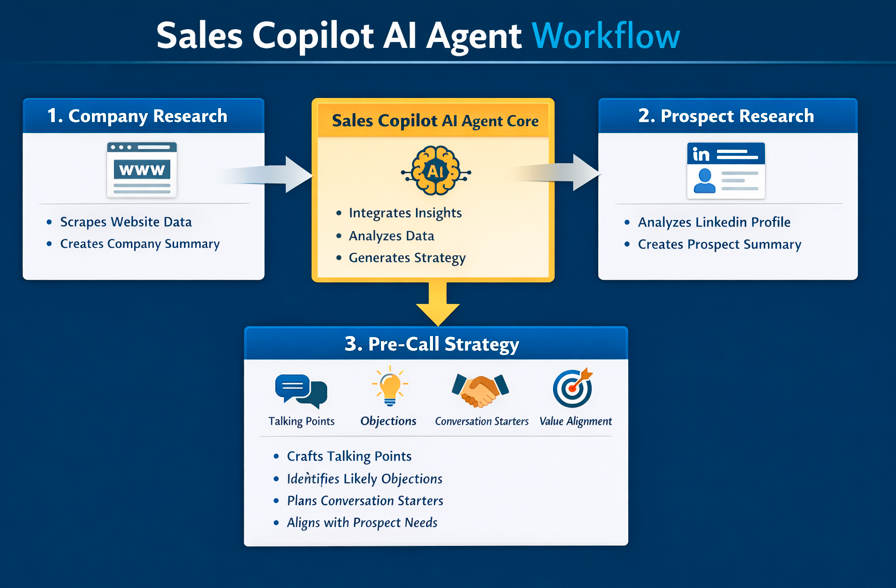

# Sales Copilot AI Agent

An AI-powered sales research assistant designed to help sales representatives prepare effectively for sales calls through structured research and strategic insights.

This project focuses on improving pre-call preparation by combining company research, prospect analysis, and strategic synthesis into a single AI-driven workflow.

---

## Problem

Sales teams often prepare for calls under tight time constraints.
Research is scattered across tabs, LinkedIn profiles are skimmed, and talking points remain generic.

As a result, sales conversations begin without proper context.

---

## Solution

The Sales Copilot AI Agent automates pre-call preparation.

Given a company website and a prospect’s LinkedIn profile, the agent produces:
- A concise, sales ready company overview
- A resume-style prospect summary
- A structured pre-call strategy with talking points, objections, and conversation starters

The goal is not to sell harder, but to enter calls informed.

---

## Workflow Diagram

---

## System Components

### 1. Company Research Tool
- Input: Company website URL
- Output: 300-word natural language summary covering company overview, products, values, location, and recent updates

### 2. Prospect Research Tool
- Input: LinkedIn profile URL
- Output: Resume-style prospect summary including role, experience, and background

### 3. Pre-Call Strategy Generator
- Input: Company summary and prospect summary
- Output: Strategic sales call preparation guide

---

## Key Features

- Human-readable, business-focused outputs
- Reasoning driven analysis
- Modular, tool-based agent design
- Designed around real sales workflows

---

## Technology

- Reasoning-focused LLMs
- No code AI agent platform
- Structured prompt engineering
- Tool orchestration through a central AI agent

---

## Note

This repository documents the design, prompts, and logic of an AI agent built.
All examples are synthetic or anonymized.
No proprietary data, credentials, or client information are included.

---

## About

This project is part of my learning journey as an aspiring AI Agent Researcher, focused on building practical, business aware AI systems through hands on implementation.

